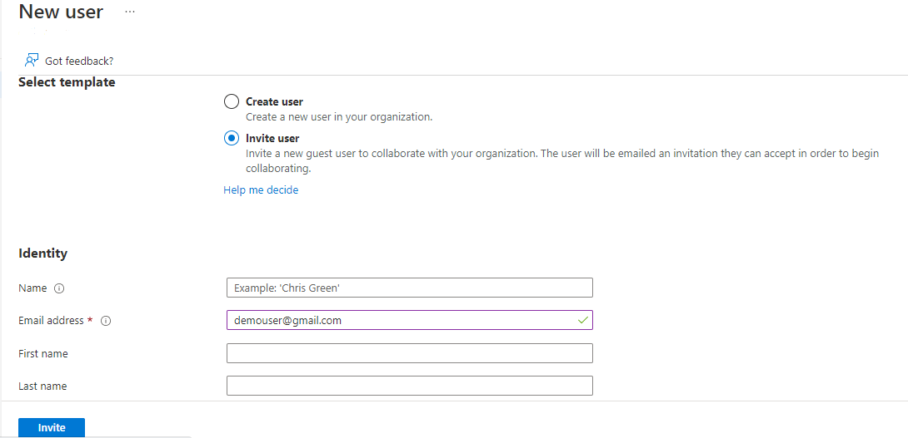
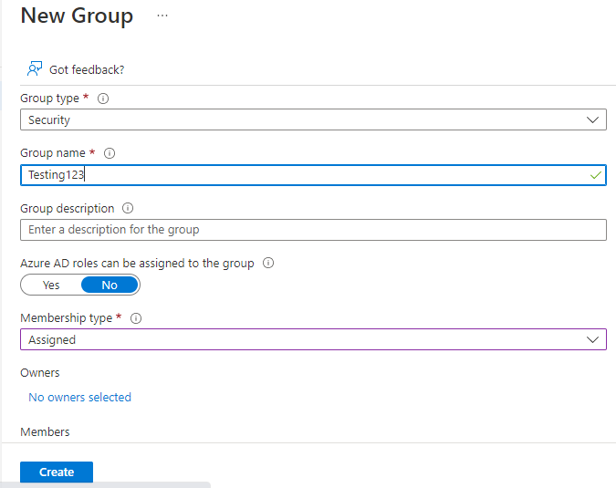
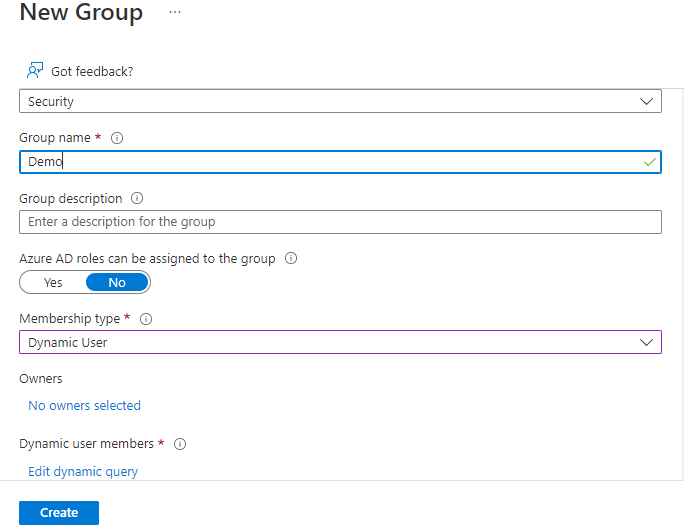

## Manage Azure Active Directory Objects

## Introduction

I'm currently performing a tenant audit for an organization. I will be using Windows OS to perform this task. I'm going to navigate to Azure Active Directorhy to manage users and groups, perform bulk user updates, manage devices, and configure self-service password reset.

## Prerequisite

An Azure Premium P1 license and administrator permissions to create users and groups, manage devices and updates, and configure sspr.

## Instructions

**Creating Azure AD Users**

Navigate to [https://aad.portal.azure.com](https://aad.portal.azure.com) and log in with your administrator account. On the portal homepage, click **Azure Active Directory**, select **Users**, then select **New user** for user accounts in your organization.

In the **Identity** section of the wizard, fill out the following information for new user:

- Enter the user name for the verified domain
- Enter the name of the user

In the **Password** section of the wizard, fill out the following information for new user:

- Create the password or auto-generate password to share with user

Skip down to the bottom of the page and select **Create**.

Overview of user account creation: 

Navigate to [https://aad.portal.azure.com](https://aad.portal.azure.com) and log in with your administrator account. On the portal homepage, click **Azure Active Directory**, select **Users**, then select **Invite user** for guest accounts for non-employees.

In the **Identity** section of the wizard, fill out the following information for guest user:

- Enter the email address

Skip down to the bottom of the page and select **Create**.

Overview of guest account creation: 

**Creating Azure AD Groups**

Navigate to [https://aad.portal.azure.com](https://aad.portal.azure.com) and log in with your administrator account. On the portal homepage, click **Azure Active Directory**, select **Groups**, then select **New group** for organizing users at your organization to an **Assigned group**.

In the **Group settings** section of the wizard, fill out the following information for new group:

- Enter the group type (**Microsoft 365** or **Security**)
- Enter the name of the group
- Enter the membership type of the group (**Assigned**)

Skip down to the bottom of the page and select **Create**.

Overview of Assigned group creation: 

Navigate to [https://aad.portal.azure.com](https://aad.portal.azure.com) and log in with your administrator account. On the portal homepage, click **Azure Active Directory**, select **Groups**, then select **New group** for organizing users at your organization to an **Dynamic user group**.

In the **Group settings** section of the wizard, fill out the following information for new group:

- Enter the group type (**Microsoft 365** or **Security**)
- Enter the name of the group
- Enter the membership type of the group (**Dynamic user**)
- Add the Dynamic query and set the **property, operator and value** to the dynamic membership rule

Skip down to the bottom of the page and select **Create**

Overview of Assigned group creation: 

